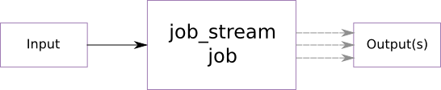
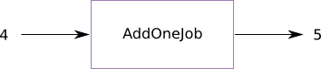
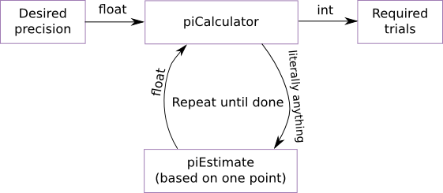

Job Stream
==========

(Most documentation is now up-to-date at [job_stream's GitHub page](https://wwoods.github.io/job_stream)).

Contents:

* [Introduction](#introduction)
* [Requirements](#requirements)
* [Building job_stream](#building-job_stream)
    * [Building and Installing the Python Module](#building-and-installing-the-python-module)
    * [Building the C++ Shared Library](#building-shared-library)
    * [Build Paths](#build-paths)
        * [Linux](#linux)
* [Distributed execution](#distributed-execution)
* [Python](#python)
    * [The Inline Module](#the-inline-module)
        * [inline.Work](#inline-work)
            * [inline.Work.init](#inline-work-init)
            * [inline.Work.job](#inline-work-job)
            * [inline.Work.finish](#inline-work-finish)
            * [inline.Work.frame](#inline-work-frame)
            * [inline.Work.reduce](#inline-work-reduce)
            * [inline.Work.result](#inline-work-result)
            * [inline.Work.run](#inline-work-run)
        * [inline.Object](#inline-object)
        * [inline.Multiple](#inline-multiple)
    * [Running External Programs (job_stream.invoke)](#python-running-external-programs)
    * [Executing Code on the main host only (job_stream.getRank)](#python-get-rank)
    * [Recipes](#python-recipes)
        * [map](#python-map)
        * [for x in ...](#for-x-in)
        * [Nested for i in x](#nested-for-i-in-x)
        * [Aggregating outside of a for loop](#aggregating-outside-of-a-for-loop)
        * [Aggregating multiple items outside of a for loop](#aggregating-multiple-items-outside-of-a-for-loop)
        * [Printing the line count of each file in a folder](#python-line-count)
* [C++ Basics](#c-basics)
    * [Reducers and Frames](#reducers-and-frames)
* [Words of Warning](#words-of-warning)
* [Unfriendly Examples](#unfriendly-examples)
* [Recent Changelog](#recent-changelog)
* [Roadmap](#roadmap)
* [Appendix](#appendix)
    * [Running the Tests](#running-the-tests)
    * [Running a job_stream C++ Application](#running-a-job_stream-application)
    * [Running in Python](#running-in-python)

##<a name="introduction"></a>Introduction

job_stream is a straightforward and effective way to implement distributed computations.  How straightforward?  Well, if we wanted to find all primes between 0 and 999:

```python
# Import the main Work object that makes using job_stream dead simple
from job_stream.inline import Work
import math

# Start by declaring work based on the list of numbers between 0 and 999 as a
# piece of `Work`.  When the w object goes out of context, the job_stream will
# get exectued
with Work(range(1000)) as w:
    # For each of those numbers, execute this method to see if that number is prime
    @w.job
    def isPrime(x):
        for i in range(2, int(math.sqrt(x)) + 1):
            if x % i == 0:
                return
        print(x)
```

If you wanted to run this script, we'll call it `test.py`, on every machine in
your MPI cluster:

```sh
$ job_stream --hostfile mpiHostfile python test.py
```

If your process is long-running, and machines in your cluster can go down, use
job_stream's built-in checkpointing to make sure your application isn't doing
the same work over and over:

```sh
$ job_stream -c --hostfile mpiHostfile python test.py
```


Pretty simple, right?  job_stream lets developers write their code in an imperative style, and does all the heavy lifting behind the scenes.  While there are a lot of task processing libraries out there, job_stream bends over backwards to make writing distributed processing tasks easy.  What all is in the box?

* **Easy python interface** to keep coding in a way that you are comfortable
* **Jobs and reducers** to implement common map/reduce idioms.  However, job_stream reducers also allow *recurrence*!
* **Frames** as a more powerful, recurrent addition to map/reduce.  If the flow of your data depends on that data, for instance when running a calculation until the result fits a specified tolerance, frames are a powerful tool to get the job done.
* **Automatic checkpointing** so that you don't lose all of your progress if a multi-day computations crashes on the second day
* **Intelligent job distribution** including job stealing, so that overloaded machines receive less work than idle ones
* **Execution Statistics** so that you know exactly how effectively your code parallelizes


##<a name="requirements"></a>Requirements

* [boost](http://www.boost.org/) (filesystem, mpi, python, regex, serialization, system, thread)
* mpi (perhaps [OpenMPI](http://www.open-mpi.org/))

Note that job_stream also uses [yaml-cpp](https://code.google.com/p/yaml-cpp/),
but for convenience it is packaged with job_stream.


##<a name="building-job-stream"></a>Building job_stream

###<a name="building-and-installing-the-python-module"></a>Building and Installing the Python Module

The python module job\_stream can be built and installed via:

    pip install job_stream

or locally:

    python setup.py install

If using [Conda](https://www.continuum.io/downloads), then install boost first:

    conda install boost
    pip install job_stream

*Note: If not using `conda`, you may need to specify custom include or library paths:*

    CPLUS_INCLUDE_PATH=~/my/path/to/boost/ \
        LD_LIBRARY_PATH=~/my/path/to/boost/stage/lib/ \
        pip install job_stream

*Different mpicxx: If you want to use an mpicxx other than your system's
default, you may also specify MPICXX=... as an environment variable.*


###<a name="building-shared-library"></a>Building the C++ Shared Library

Create a build/ folder, cd into it, and run:

    cmake .. && make -j8 test

*Note: You may need to tell the compiler where boost's libraries or include
files are located.  If they are not in the system's default paths, extra paths
may be specified with e.g. environment variables like this:*

    CPLUS_INCLUDE_PATH=~/my/path/to/boost/ \
        LD_LIBRARY_PATH=~/my/path/to/boost/stage/lib/ \
        bash -c "cmake .. && make -j8 test"


###<a name="build-paths"></a>Build Paths

Since job\_stream uses some of the compiled boost libraries,
know your platform's mechanisms of amending default build and run paths:

####<a name="linux"></a>Linux

* CPLUS_INCLUDE_PATH=... - Colon-delimited paths to include directories
* LIBRARY_PATH=... - Colon-delimited paths to static libraries for linking only
* LD_LIBRARY_PATH=... - Colon-delimited paths to shared libraries for linking
  and running binaries

##<a name="distributed-execution"></a>Distributed execution

job_stream comes bundled with a binary to help running job_stream applications: that executable is installed as `job_stream` in your Python distribution's `bin` folder.  At its simplest, `job_stream` is a wrapper for `mpirun`.  This means that it provides support for an MPI-like hostfile that lists machines to distribute your work across.  Example usage:

```
# This file's contents are in a file called hostfile
machine1
machine2
#machine3  Commented lines will not be used
```

```
$ job_stream --hostfile hostfile -- python script.py
```

The above will run `script.py` across machine1 and machine2.  The `job_stream`
wrapper also allows specifying checkpoints so that you do not lose progress
on a job if your machines go down:

```
$ job_stream -c ...
```

The `-c` flag means that progress is to be stored in the working directory as
`job_stream.chkpt`; a different path and filename may be specified by using
`--checkpoint PATH` instead.  Should the application crash, the job may be
resumed by re-executing the same command as the original invocation.

Often, a machine you are running experiments from will have a cluster that you
want to run all of your work on.  In this case, `job_stream` lets you specify
a default hostfile to use:

```
$ job_stream config hostfile=./path/to/hostfile
```

The configuration may be verified by running `job_stream config` without any
additional arguments.

##<a name="python"></a>Python

###<a name="the-inline-module"></a>The Inline Module

The primary (user-friendly) way to use job_stream in python is via the inline
module, which provides the objects `Work`, `Object`, and `Multiple`.  Usually,
only the `Work` object is required:

```python
from job_stream.inline import Work
```

####<a name="inline-work"></a>inline.Work

The main element used by `job_stream.inline` is the `Work` object.  `Work`
is initialized with a list (or generator).  Each element of this initial
list enters the system as a piece of work within the job stream.  

Similar to traditional imperative coding practices, `job_stream.inline` passes
work in the same direction as the source file.  In other words, if the system
starts with:

```python
w = Work([ 1, 2, 3 ])
```

Then the numbers 1, 2, and 3 will be distributed into the system.  Once work
is in the system, we typically deal with them using decorated methods.  *The
ordering of the decorated methods matters!*  `job_stream.inline` is designed
so that your work flows in the same direction as your code.  For instance,
running:

```python
w = Work([ 1, 2 ])
@w.job
def first(w):
    print("a: {}".format(w))
    return w

@w.job
def second(w):
    print("b: {}".format(w))
    return w

w.run()
```

will always print "a: ..." before "b: ..." for any given piece of work that
enters the system.  More can be learned about [`inline.Work.job`](#inline-work-job)
in the corresponding section.

> **Multiprocessing** - Python has the <a href="https://wiki.python.org/moin/GlobalInterpreterLock">GIL</a>
  in the default implementation, which typically limits pure-python code to a single thread.  To get around
  this, the `job_stream` module by default uses multiprocessing for all jobs - that is,
  your python code will run in parallel on all cores, in different processes.

> If this behavior is not desired, particularly if your application loads a lot of data
  in memory that you would rather not duplicate, passing useMultiprocessing = False to the
  `Work()` object's initializer will force all job_stream activity to happen
  within the original process:

>     w = Work([ 1, 2 ], useMultiprocessing = False)

#####<a name="inline-work-init"></a>inline.Work.init

In practical systems, the initial work often might be generated by some
initial code.  If you distribute your code to multiple machines, then all
code outside of `Work`'s methods will be executed N times, where N
is the number of machines that you run your script on.  For example, running:

```python
print("Init!")
w = Work([ 1 ])
w.run()
```

on four machines, like this:

    $ mpirun -host a,b,c,d python script.py
    Init!
    Init!
    Init!
    Init!

will print, "Init!", four times.  The work element, `1`, will be be constructed
and put  into four different lists (one on each machine).  However, as a piece
of work, `1` will only go into the system once.

If it is important that setup code only be run once, for instance if a results
file needs to be initialized, or some debug information is printed, then
the init function is useful.  For instance, the above code might be refactored
as this:

```python
w = Work()
@w.init
def generateWork():
    print("Init!")
    return 1
w.run()
```

Now, no matter how many machines the code is parallelized on, "Init!" will
only be printed once, and the initial work `1` is only generated on one
machine.  Since it is just an integer in this case, that's not so bad, but
for more complicated initial work it might make a difference.

The final work passed into the system will be the union of anything passed
to `Work`'s initializer, and anything returned from an `@Work.init` decorated
function.  Returning `None` from a function will result in no work being added.
To emit multiple pieces of work, look at the [`inline.Multiple`](#inline-multiple)
object.

**Note:** `Work.init` is special in that it does not matter where in your
source code it appears.  Any functions declared with `Work.init` are *always*
executed exactly one time, before any work is processed.


#####<a name="inline-work-job"></a>inline.Work.job

A job is the main workhorse of `job_stream`.  It takes as input a single piece
of work, processes it, and in turn emits zero or more pieces of work that flow
to the next element of the pipeline.  For instance, to add one to a list of
integers:

```python
from job_stream.inline import Work
w = Work([ 1, 2, 3 ])

# Now that we have 1, 2, and 3 as pieces of work in the system, this next
# function will be called once with each value (possibly in parallel).

@w.job
def addOne(w):
    return w + 1

# addOne will have been called 3 times, and have emitted 3 more pieces of work
# to the next element in the job stream.

w.run()
```

**I/O Safety:** It is not safe to write external i/o (such as a file) within
a job.  This is because jobs have no parallelism guards - that is, two jobs
executing concurrently might open and append to a file at the same time.  On
some filesystems, this results in e.g. two lines of a csv being combined into
a single, invalid line.  To work around this, see [`inline.Work.result`](#inline-work-result).


#####<a name="inline-work-finish"></a>inline.Work.finish

Decorates a method that only runs on the main host, and only after all work has
finished.  Since MPI common code (outside of job_stream, that is) runs on all
machines, it is occasionally useful to run code only once to finish a
calculation.  For instance, maybe the final results should be pretty-printed
through `pandas`:

```python
import pandas
from job_stream.inline import Work
w = Work([ 1, 2, 3 ])
@w.job
def addOne(w):
    return w + 1

@w.finish
def pandasPrintResults(results):
    print(pandas.DataFrame(results))
```

Note that this function is similar to [inline.Work.result](#inline-work-result),
but less efficient as it requires keeping all results leaving the job stream in
memory.  On the other hand, `finish` has access to all results at once, unlike
`result`.


#####<a name="inline-work-frame"></a>inline.Work.frame

Frames (and their cousins Reducers) are the most complicated feature in
`job_stream`.  A frame is appropriate if:

* A while loop would be used in non-parallelizable code
* Individual pieces of work need fan-out and fan-in

Frames have three parts - an "all outstanding work is finished" handler, an
aggregator, and everything in between, which is used to process recurred work.

For example, suppose we want to sum all digits between 1 and our work, and
report the result.  The best way to design this type of system is with a Frame,
implemented in `inline` through `Work.frame` and `Work.frameEnd`.  The easiest
way to think of these is as the two ends of a `while` loop - `frame` is
evaluated as a termination condition, and is also evaluated before anything
happens.  `frameEnd` exists to aggregate logic from within the `while` loop
into something that `frame` can look at.

```python
from job_stream.inline import Work, Multiple
w = Work([ 4, 5, 8 ])

@w.frame
def sumThrough(store, first):
    # Remember, this is called like the header of a while statement: once at
    # the beginning, and each time our recurred work finishes.  Anything
    # returned from this function will keep the loop running.
    if not hasattr(store, 'value'):
        # Store hasn't been initialized yet, meaning that this is the first
        # evaluation
        store.first = first
        store.value = 0
        return first

    # If we reach here, we're done.  By not returning anything, job_stream knows
    # to exit the loop (finish the reduction).  The default behavior of frame is
    # to emit the store object itself, which is fine.

# Anything between an @frame decorated function and @frameEnd will be executed
# for anything returned by the @frame or @frameEnd functions.  We could have
# returned multiple from @frame as well, but this is a little more fun

@w.job
def countTo(w):
    # Generate and emit as work all integers ranging from 1 to w, inclusive
    return Multiple(range(1, w + 1))

@w.frameEnd
def handleNext(store, next):
    # next is any work that made it through the stream between @frame and
    # @frameEnd.  In our case, it is one of the integers between 1 and our
    # initial work.
    store.value += next

@w.result
def printMatchup(w):
    print("{}: {}".format(w.first, w.value))

w.run()
```

Running the above code will print:

    $ python script.py
    4: 10
    8: 36
    5: 15

Note that the original work is out of order, but the sums line up.  This is
because a frame starts a new reduction for each individual piece of work
entering the `@frame` decorated function.

#####<a name="inline-work-reduce"></a>inline.Work.reduce

TODO.  Almost always, programs won't need a reducer.  Frames and the
`Work.result` decorator replace them.  However, if the aggregation of a
calculation is resource intensive, `Work.reduce` can help since it can be
distributed.


#####<a name="inline-work-result"></a>inline.Work.result

Since jobs are not I/O safe, `job_stream.inline.Work` provides the `result`
decorator.  The `result` decorator must be the last element in your job stream,
and decorates a function that takes as input a single piece of work.  The
decorated function will be called exactly once for each piece of work exiting
the stream, and is always handled on the main host.  

For example, here is some code that takes a few objects, increments their `b`
member, and dumps them to a csv:

```python
from job_stream.inline import Work
w = Work([ { 'name': 'yodel', 'b': 1 }, { 'name': 'casper', 'b': 99 } ])

@w.job
def addOne(w):
    w['b'] += 1
    return w

# Note that @w.init is special, and can be declared immediately before the
# output job, regardless of jobs before it.  It will always be executed first.
@w.init
def makeCsv():
    with open('out.csv', 'w') as f:
        f.write("name,b\n")

# @w.result is also special, as it is not allowed to be anywhere except for
# the end of your job stream.  
@w.result
def handleResult(w):
    with open('out.csv', 'a') as f:
        f.write("{},{}\n".format(w['name'], w['b']))

w.run()
```

Return values from `Work.result` are ignored.

#####<a name="inline-work-run"></a>inline.Work.run

After all elements in the job stream are specified, calling `Work.run()` will
execute the stream.  If your stream takes a long time to execute, it might
be worth turning on checkpointing.  `run()` takes the following kwargs:

* **checkpointFile** (string) The file path to save checkpoints at.  If
  specified, checkpoints are enabled.  By default, a checkpoint
  will be taken every 10 minutes (even with 20 machines, checkpoints typically
  take around 10 seconds).
* **checkpointInterval** (float) The number of seconds between the completion of
  one checkpoint and the starting of the next.  Defaults to 600.
* **checkpointSyncInterval** (float) Used for debugging only.  This
  is the mandatory quiet period between the detection of all communication
  ceasing and the actual checkpointing.

Typically, `Work.run()` will return `None`.  However, if your stream has no
`Work.result` decorated function, then on the primary host, `Work.run()` will
return a list of work that left the system.  On other hosts, it will still
return `None`.

####<a name="inline-object"></a>inline.Object

`inline.Object` is just a basic object that can be used to store arbitrary
attributes.  As a bonus, its constructor can take kwargs to set.  `Object` is
typically used with frames and reducers:

```python
from job_stream.inline import Work, Object
w = Work([ 1 ])

@w.frame(store = lambda: Object(init = False))
def handleFirst(store, obj):
    if not store.init:
        store.init = True
        # ...

# ...
```

####<a name="inline-multiple"></a>inline.Multiple

The Zen of Python states that explicit is better than implicit.  Since lists or
list-like objects may be desired to float around a job stream, all of
`job_stream.inline` assumes that return values are single pieces of work.  If
that is not the case, and a single job should emit multiple pieces of work,
simply wrap a collection with the `Multiple` object:

```python
from job_stream.inline import Work, Multiple
w = Work([ 1 ])

@w.job
def duplicate(w):
    return Multiple([ w, w ])
```

Now, whatever work flows into `duplicate` will flow out of it with an extra
copy.


###<a name="python-running-external-programs"></a>Running External Programs (job_stream.invoke)

It is tricky to launch another binary from an MPI process.
Use `job_stream.invoke()` instead of e.g. `subprocess.Popen` to work around
a lot of the issues caused by doing this.  Example usage:

```python
from job_stream import invoke
out, err = invoke([ '/bin/echo', 'hi', 'there' ])
# out == 'hi there\n'
# err == '' (contents of stderr)
```

`job_stream.invoke()` will raise a RuntimeError exception for any non-zero
return value from the launched program.  If some errors are transient, and those
errors have a unique footprint in stderr, the strings specifying those errors
may be passed as kwarg `transientErrors`.  Example:

```python
from job_stream import invoke
out, err = invoke([ '/bin/mkdir', 'test' ],
        transientErrors = [ 'Device not ready' ])
```

mkdir will be run up to kwarg `maxRetries` times (default 20), retrying until
a non-zero result is given.

###<a name="python-get-rank"></a>Executing Code on the main host only (job_stream.getRank)

When running `job_stream` code in a multi-machine environment, code will normally get executed multiple times.  For instance, running the following script via `mpirun -host a,b,c script.py`:

```python
print("Hello, world!")
```

will print "Hello, world!" three different times, one on each host.  In part of a workflow, this may be circumvented via `inline.Work.init`.  However, this only properly handles initialization code.  If manual control over the execution of code across multiple machines is desired, `job_stream.getRank()` should be used as follows:

```python
import job_stream
if job_stream.getRank() == 0:
    print("Hello, world!")
```

This configuration will only result in "Hello, world!" begin printed a single time.

###<a name="python-recipes"></a>Recipes

####<a name="python-map"></a>map

If you want to replace a python `map(func, sequence[, sequence, ...])` with
a parallelized version, `job_stream` provides `job_stream.map()` which has
the same syntax:

```python
from job_stream import map
addOne = lambda w: w+1
print(map(addOne, [ 1, 2, 3 ]))
# prints [2, 3, 4]
```

####<a name="for-x-in"></a>for x in ...

To parallelize this:

```python
for x in range(10):
    print x
```

Do this:

```python
from job_stream.inline import Work
w = Work(range(10))

@w.job
def printer(x):
    print x
    # Any value returned (except for a list type) will be emitted from the job.
    # A list type will be unwrapped (emit multiple)
    return x

w.run()
```


####<a name="nested-for-i-in-x"></a>Nested for i in x

To parallelize this (computing triangle numbers):

```python
for x in range(1, 10):
    sum = 0
    for i in range(x+1):
        sum += i
    print("{}: {}".format(x, sum))
```

Write this:

```python
from job_stream.inline import Multiple, Work
with Work(range(1, 10)) as w:
    # For each of our initial bits of work, we open a frame to further
    # parallelize within each bit of work
    @w.frame
    def innerFor(store, first):
        """This function is called whenever everything in the frame is
        finished.  Usually, that means it is called once when a frame should
        request more work, and once when all of that work is done.

        Any work returned by this function will be processed by the jobs within
        the frame, and finally aggregated into the 'store' variable at the
        frameEnd function."""

        if not hasattr(store, 'init'):
            # First run, uninitialized
            store.init = True
            store.value = 0
            # Anything returned from a frame or frameEnd function will recur to
            # all of the jobs between the frame and its corresponding frameEnd
            return Multiple(range(first+1))

        # If we get here, we've already processed all of our earlier recurs.
        # To mimic the nested for loop above, that just means that we need to
        # print our results
        print("{}: {}".format(first, store.value))

    @w.frameEnd
    def innerForEnd(store, next):
        store.value += next
```


####<a name="aggregating-outside-of-a-for-loop"></a>Aggregating outside of a for loop

To parallelize this:

```python
results = []
for i in range(10):
    results.append(i * 2)
result = sum(results)
```

Write this:

```python
from job_stream.inline import Object, Work
w = Work(range(10))

@w.job
def timesTwo(i):
    return i * 2

# reduce is
@w.reduce(store = lambda: Object(value = 0), emit = lambda store: store.value)
def gatherResults(store, inputs, others):
    for i in inputs:
        store.value += i
    for o in others:
        store.value += o.value

# Run the job stream and collect the first (and only) result into our sum
result, = w.run()
```


####<a name="aggregating-multiple-items-outside-of-a-for-loop"></a>Aggregating multiple items outside of a for loop

To parallelize this:

```python
results = []
for i in range(10):
    results.append(i)
    results.append(i * 2)
result = sum(results)
```

Write this:

```python
from job_stream.inline import Multiple, Object, Work
w = Work(range(10))

@w.job
def timesTwo(i):
    return Multiple([ i, i * 2 ])

# reduce is
@w.reduce(store = lambda: Object(value = 0), emit = lambda store: store.value)
def gatherResults(store, inputs, others):
    for i in inputs:
        store.value += i
    for o in others:
        store.value += o.value

# Run the job stream and collect the first (and only) result into our sum
result, = w.run()
```


####<a name="python-line-count"></a>Printing the line count of each file in a folder

For more of a real-world example, if we wanted line counts for all of the files in a directory:

```python
# Import the inline library of job_stream (works for 99% of cases and produces
# code that is easier to follow).  Object is a blank object, and Work is the
# workhorse of the job_stream.inline library.
from job_stream.inline import Object, Work
import os
import sys
path = sys.argv[1] if len(sys.argv) > 1 else '.'

# Start by defining our Work as the files in the given directory
with Work([ p for p in os.listdir(path) if os.path.isfile(p) ]) as w:
    # For each file given, count the number of lines in the file and print
    @w.job
    def countLines(filename):
        count = len(list(open(filename)))
        print("{}: {} lines".format(filename, count))
        return count

    # Join all of the prior line counts by summing them into an object's
    # "total" attribute
    @w.reduce(store = lambda: Object(total = 0))
    def sumDirectory(store, inputs, others):
        for count in inputs:
            store.total += count
        for o in others:
            store.total += o.total

    # Now that we have the total, print it
    @w.job
    def printTotal(store):
        print("======")
        print("Total: {} lines".format(store.total))
```


##<a name="c-basics"></a>C++ Basics

job_stream works by allowing you to specify various "streams" through your
application's logic.  The most basic unit of work in job_stream is the job,
which takes some input work and transforms it into zero or more outputs:



That is, some input work is required for a job to do anything.  However, the
job may choose to not pass anything forward (perhaps save something to a file
instead), or it might apply some transformation(s) to the input and then output
the changed data.  For our first job, supppose we wanted to make a basic job
that takes an integer and increments it, forwarding on the result:



The corresponding code for this job follows:

    #include <job_stream/job_stream.h>
    //All work comes into job_stream jobs as a unique_ptr; this can be used
    //to optimize memory bandwidth locally.
    using std::unique_ptr;

    /** Add one to the integer input and forward it. */
    class AddOneJob : public job_stream::Job<AddOneJob, int> {
    public:
        /** The name used to describe this job in a YAML file */
        static const char* NAME() { return "addOne"; }
        void handleWork(unique_ptr<int> work) {
            this->emit(*work + 1);
        }
    } addOneJob;

The parts of note are:

* Template arguments to job_stream::Job - the class being defined, and the
  expected type of input,
* NAME() method, which returns a string that we'll use to refer to this
  type of job,
* handleWork() method, which is called for each input work generated,
* this->emit() call, which is used to pass some serializable object forward as
  output, and
* this->emit() can take any type of argument - the output's type and content do
  not need to have any relation to the input.
* There MUST be a global instance allocated after the class definition.  This
  instance is not ever used in code, but C++ requires a instance for certain
  templated code to be generated.

*NOTE - all methods in a job_stream job must be thread-safe!*

In order to use this job, we would need to define a simple `adder.yaml` file:

    jobs:
      - type: addOne

Running this with some input produces the expected result:

    local$ pwd
    /.../dev/job_stream
    local$ cd build
    local$ cmake .. && make -j8 example
    ...
    # Any arguments after the YAML file and any flags mean to run the job stream
    # with precisely one input, interpreted from the arguments
    local$ example/job_stream_example ../example/adder.yaml 1
    2
    (some stats will be printed on termination)
    # If no arguments exist, then stdin will be used.
    local$ example/job_stream_example ../example/adder.yaml <<!
    3
    8
    !
    # Results - note that when you run this, the 9 might print before the 4!
    # This depends on how the thread scheduling works out.
    4
    9
    (some stats will be printed on termination)
    local$

##<a name="reducers-and-frames"></a>Reducers and Frames

Of course, if we could only transform and potentially duplicate input then
job_stream wouldn't be very powerful.  job_stream has two mechanisms that make
it much more useful - reducers, which allow several independently processed
work streams to be merged, and recursion, which allows a reducer to pass work
back into itself.  Frames are a job_stream idiom to make the combination of
reducers and recursion more natural.

To see how this fits, we'll calculate pi experimentally to a desired precision.
We'll be using the area calculation - since A = R*pi^2, pi = sqrt(A / R).  
Randomly distributing points in a 1x1 grid and testing if they lie within the
unit circle, we can estimate the area:


The job_stream part of this will take as its input a floating point number which
is the percentage of error that we want to reach, and will emit the number of
experimental points evaluated in order to reach that accuracy.  The network
looks like this:



As an aside, the "literally anything" that the piCalculator needs to feed to
piEstimate is because we'll have piEstimate decide which point to evaluate.  
This is an important part of designing a job_stream pipeline - generality.  If,
for instance, we were to pass the point that needs evaluating to piEstimate,
then we have locked our piCalculator into working with only one method of
evaluating pi.  With the architecture shown, we can substitute any number of
pi estimators and compare their relative efficiencies.

Before coding our jobs, let's set up the YAML file `pi.yaml`:

    jobs:
      - frame:
            type: piCalculator
        jobs:
            - type: piEstimate

This means that our pipe will consist of one top-level job, which itself has no
type and a stream of "jobs" it will use to transform data.  Wrapped around its
stream is a "frame" of type piCalculator.  This corresponds to our above
diagram.

piCalculator being a frame means that it will take an initial work,
recur into itself, and then aggregate results (which may be of a different type
than the initial work) until it stops recurring.  The code for it looks like
this:

    struct PiCalculatorState {
        float precision;
        float piSum;
        int trials;

    private:
        //All structures used for storage or emit()'d must be serializable
        friend class boost::serialization::access;
        template<class Archive>
        void serialize(Archive& ar, const unsigned int version) {
            ar & precision & piSum & trials;
        }
    };

    /** Calculates pi to the precision passed as the first work.  The template
        arguments for a Frame are: the Frame's class, the storage type, the
        first work's type, and subsequent (recurred) work's type. */
    class PiCalculator : public job_stream::Frame<PiCalculator,
            PiCalculatorState, float, float> {
    public:
        static const char* NAME() { return "piCalculator"; }

        void handleFirst(PiCalculatorState& current, unique_ptr<float> work) {
            current.precision = *work * 0.01;
            current.piSum = 0.0f;
            current.trials = 0;
            //Put work back into this Frame.  This will trigger whatever method
            //of pi approximation is defined in our YAML.  We'll pass the
            //current trial index as debug information.
            this->recur(current.trials++);
        }

        void handleWork(PiCalculatorState& current, unique_ptr<float> work) {
            current.piSum += *work;
        }

        void handleDone(PiCalculatorState& current) {
            //Are we done?
            float piCurrent = current.piSum / current.trials;
            if (fabsf((piCurrent - M_PI) / M_PI) < current.precision) {
                //We're within desired precision, emit trials count
                fprintf(stderr, "Pi found to be %f, +- %.1f%%\n", piCurrent,
                        current.precision * 100.f);
                this->emit(current.trials);
            }
            else {
                //We need more iterations.  Double our trial count
                for (int i = 0, m = current.trials; i < m; i++) {
                    this->recur(current.trials++);
                }
            }
        }
    } piCalculator;

Similar to our first addOne job, but we've added a few extra methods -
handleFirst and handleDone.  handleFirst is called for the work that starts
a reduction and should initialize the state of the current reduction.  
handleWork is called whenever a recur'd work finishes its loop and ends up back
at the Frame.  Its result should be integrated into the current state somehow.
handleDone is called when there is no more pending work in the frame, at which
point the frame may either emit its current result or recur more work.  If
nothing is recur'd, the reduction is terminated.

Our piEstimate job is much simpler:

    class PiEstimate : public job_stream::Job<PiEstimate, int> {
    public:
        static const char* NAME() { return "piEstimate"; }
        void handleWork(unique_ptr<int> work) {
            float x = rand() / (float)RAND_MAX;
            float y = rand() / (float)RAND_MAX;
            if (x * x + y * y <= 1.0) {
                //Estimate area as full circle
                this->emit(4.0f);
            }
            else {
                //Estimate area as nothing
                this->emit(0.0f);
            }
        }
    } piEstimate;

So, let's try it!

    local$ cd build
    local$ cmake .. && make -j8 example
    local$ example/job_stream_example ../example/pi.yaml 10
    Pi found to be 3.000000, +- 10.0%
    4
    (debug info as well)

So, it took 4 samples to arrive at a pi estimation of 3.00, which is within 10%
of 3.14.  Hooray!  We can also run several tests concurrently:

    local$ example/job_stream_example ../example/pi.yaml <<!
    10
    1
    0.1
    !
    Pi found to be 3.000000, +- 10.0%
    4
    Pi found to be 3.167969, +- 1.0%
    Pi found to be 3.140625, +- 0.1%
    1024
    1024
    0 4% user time (3% mpi), 1% user cpu, 977 messages (0% user)
    C 4% user time, 0% user cpu, quality 0.00 cpus, ran 1.238s

The example works!  Bear in mind that the efficiency ratings for a task like
this are pretty poor.  Since each job only does a few floating point operations,
he communication overhead well outweighs the potential benefits of parallelism.
However, once your jobs start to do even a little more work, job_stream quickly
becomes beneficial.  On our modest research cluster, I have jobs that routinely
report a user-code quality of 200+ cpus.


##<a name="words-of-warning"></a>Words of Warning

fork()ing a child process can be difficult in a threaded MPI application.  To
work around these difficulties, it is suggested that your application use
job_stream::invoke (which forwards commands to a properly controlled
libexecstream).

Job and reduction routines MUST be thread safe.  Job_stream handles most of this
for you.  However, do NOT create a shared buffer in which to do your work as
part of a job class.  If you do, make sure you declare it thread\_local (which
requires static).

It is wrong to build a Reducer or Frame that simply appends new work into a
list.  Doing so will cause excessively large objects to be written to checkpoint
files and cause the backups required to support checkpoints to bloat
unnecessarily (backups meaning the copy of each store object that represents its
non-mutated state before the work began.  Without this, checkpointing would have
to wait for all Work to finish before completing).
This leads to very long-running de/serialization routines, which can cause very
poor performance in some situations.

If you use checkpoints and your process crashes, it is possible that any
activity _outside_ of job_stream will be repeated.  In other words, if one of
your jobs appends content to a file, then that content might appear in the
file multiple times.  The recommended way to get around this is to have your
work output to different files, with a unique, deterministic file name for each
piece of work that outputs.  Another approach is to use a reducer which gathers
all completed work, and then dumps it all to a file at once in handleDone().

Sometimes, passing -bind-to-core to mpirun can have a profoundly positive impact
on performance.


##<a name="unfriendly-examples"></a>Unfriendly Examples

*These are old and aren't laid out quite as nicely.  However, there is reasonably
good information here that isn't covered above.  So, it's left here for now.*

The following example is fully configured in the "example" subdirectory.

Essentially, you code some jobs, and optionally a reducer for combining results:

    #include <job_stream/job_stream.h>

    using std::unique_ptr;

    /** Add one to any integer we receive */
    class AddOneJob : public job_stream::Job<int> {
    public:
        static AddOneJob* make() { return new AddOneJob(); }

        void handleWork(unique_ptr<int> work) {
            this->emit(*work + 1);
        }
    };


    class DuplicateJob : public job_stream::Job<int> {
    public:
        static DuplicateJob* make() { return new DuplicateJob(); }

        void handleWork(unique_ptr<int> work) {
            this->emit(*work);
            this->emit(*work);
        }
    };


    class GetToTenJob : public job_stream::Job<int> {
    public:
        static GetToTenJob* make() { return new GetToTenJob(); }

        void handleWork(unique_ptr<int> work) {
            if (*work < 10) {
                this->emit(*work, "keep_going");
            }
            else {
                this->emit(*work, "done");
            }
        }
    };


    class SumReducer : public job_stream::Reducer<int> {
    public:
        static SumReducer* make() { return new SumReducer(); }

        /** Called to initialize the accumulator for this reduce.  May be called
            several times on different hosts, whose results will later be merged
            in handleJoin(). */
        void handleInit(int& current) {
            current = 0;
        }

        /** Used to add a new output to this Reducer */
        void handleAdd(int& current, unique_ptr<int> work) {
            current += *work;
        }

        /** Called to join this Reducer with the accumulator from another */
        void handleJoin(int& current, unique_ptr<int> other) {
            current += *other;
        }

        /** Called when the reduction is complete, or nearly - recur() may be used
            to keep the reduction alive (inject new work into this reduction). */
        void handleDone(int& current) {
            this->emit(current);
        }
    };


    class GetToValueReducer : public job_stream::Reducer<int> {
    public:
        static GetToValueReducer* make() { return new GetToValueReducer(); }

        void handleInit(int& current) {
            current = 0;
        }

        void handleAdd(int& current, unique_ptr<int> work) {
            //Everytime we get an output less than 2, we'll need to run it through
            //the system again.
            printf("Adding %i\n", *work);
            if (*work < 3) {
                this->recur(3);
            }
            current += *work;
        }

        void handleJoin(int& current, unique_ptr<int> other) {
            current += *other;
        }

        void handleDone(int& current) {
            printf("Maybe done at %i\n", current);
            if (current >= this->config["value"].as<int>()) {
                this->emit(current);
            }
            else {
                //Not really done, put work back in as our accumulated value.
                this->recur(current);
            }
        }
    };

Register them in your main, and call up a processor:

    int main(int argc, char* argv []) {
        job_stream::addJob("addOne", AddOneJob::make);
        job_stream::addJob("duplicate", DuplicateJob::make);
        job_stream::addJob("getToTen", GetToTenJob::make);
        job_stream::addReducer("sum", SumReducer::make);
        job_stream::addReducer("getToValue", GetToValueReducer::make);
        job_stream::runProcessor(argc, argv);
        return 0;
    }

Define a pipeline / configuration:

    # example1.yaml
    reducer: sum
    jobs:
        - type: addOne
        - type: addOne

And run it!

    # This will compute 45 + 2 and 7 + 2 separately, then sum them, returning
    # one number (because of the reducer).
    $ mpirun -np 4 ./job_stream_example example1.yaml <<!
        45
        7
        !
    56
    $

Want to get a little more complicated?  You can embed modules:

    # example2.yaml
    jobs:
        - type: addOne
        # Not defining type (or setting it to "module") starts a new module
        # that can have its own reducer and job chain
        -   reducer: sum
            jobs:
                - type: duplicate

That pipeline will, individually for each input row, add one and double it:

    $ mpirun -np 4 ./job_stream_example example2.yaml <<!
        1
        2
        3
        !
    4
    6
    8
    $

Does your program have more complex flow?  The emit() function can take a second
argument, which is the name of the target to route to.  For instance, if we add
to main.cpp:

    class GetToTenJob : public job_stream::Job<int> {
    public:
        static GetToTenJob* make() { return new GetToTenJob(); }

        void handleWork(unique_ptr<int> work) {
            if (*work < 10) {
                this->emit(*work, "keep_going");
            }
            else {
                this->emit(*work, "done");
            }
        }
    };

    //Remember to register it in main...

And then you set up example3.yaml:

    # example3.yaml
    # Note that our module now has an "input" field - this determines the first
    # job to receive work.  Our "jobs" field is now a map instead of a list,
    # with the key being the id of each job.  "to" determines where emitted
    # work goes - if "to" is a mapping, the job uses "emit" with a second
    # argument to guide each emitted work.
    input: checkValue
    jobs:
        addOne:
            type: addOne
            to: checkValue
        checkValue:
            type: getToTen
            to:
                keep_going: addOne
                done: output

Run it:

    $ mpirun -np 4  ./job_stream_example example3.yaml <<!
        1
        8
        12
        !
    12
    10
    10
    $

Note that the "12" is output first, since it got routed to output almost
immediately rather than having to pass through many AddOneJobs.

You can also have recurrence in your reducers - that is, if a reduction finishes
but the results do not match a criteria yet, you can put more tuples through
in the same reduction:

    # example4.yaml
    # Reducer recurrence
    reducer:
        type: getToValue
        value: 100
    jobs:
        - type: duplicate
        - type: addOne

Running this with 1 will yield 188 - essentially, since handleAdd() calls recur
for each value less than 3, two additional "3" works get added into the system
early on.  So handleDone() gets called with 20, 62, and finally 188.


##<a name="recent-changelog"></a>Recent Changelog

* 2016-7-13 - Minor fix for bin/job_stream; hosts now remain sorted in their
  original order, fixing the server with rank 0 to a specific host.
* 2016-7-07 - mpirun doesn't automatically forward environment variables; this
  has been fixed for the job_stream binary.  Python version bump to 0.1.19.
* 2016-7-05 - Checkpoints now make a .done file to prevent accidental results
  overwriting.  Updated job_stream binary to be able to specify checkpoints
  and to have a slightly improved interface.  Python version to 0.1.18.
* 2016-6-28 - Added job_stream binary to stop users from needing to know how
  to use mpirun, and more importantly, to open the way for uses like maxCpu
  or flagging other resources.
* 2016-6-27 - A fix and additional testing for multiprocessing timing code.
  Streamlined to be more effective to boot.  Version to 0.1.14.
* 2016-6-24 - Fixed python timing code for multiprocessing.  Reported CPU
  efficiencies are now valid for python code.  Version bump to 0.1.13.
* 2016-6-23 - job_stream now processes work in a depth-first fashion rather
  than breadth-first.  The utility of this change is for progress bars; no
  functionality should be altered as an effect of this change.

  Updated multiprocessing in Python driver to work with new code organization,
  multiprocessing was not effective before.  Stats still need to be fixed there.
  Version bump to 0.1.12.
* 2016-6-22 - inline.Multiple() in Python now ignores None results.
  Version 0.1.11.
* 2016-6-14 - Python 3 support and embedded two of the boost libraries that
  are not typically associated with boost-python.  In other words, a
  `conda install boost` preceding a `pip install job_stream` now works with
  both Python 2 and 3.  System boost libraries should still work as before
  (although job_stream might use an outdated version of boost-mpi).

  Version bump to 0.1.8, 0.1.9 and 0.1.10 (build fix).
* 2016-4-14 - Added a `map()` function that is compatible with the builtin
  `map()` function.
* 2015-5-26 - README warning about Frames and Reducers that store a list of
  objects.  Python inline frames can specify useMultiprocessing=False separate
  from the work.  Minor efficiency improvement to copy fewer Python object
  strings.
* 2015-5-21 - Build on Mac OS X is now fixed.
* 2015-3-26 - `job_stream.inline.Work` can now be used in `with` blocks and has
  a `finish()` method.  Args for `Work.run()` were moved to `Work`'s
  initializer.
* 2015-2-6 - job_stream.inline python module can disable multiprocessing by
  passing useMultiprocessing = False in the `Work` object's initializer.
* 2015-1-30 - Updated README to include job_stream.invoke, and exposed
  checkpointInfo function for debugging.
* 2015-1-29 - Added inline.result() function, which lets users write code that
  is executed exactly once per result, and always on the main host.
* 2015-1-28 - Added inline.init() function, which ensures code is only executed
  once regardless of checkpoint or host status.
* 2015-1-7 - Added job_stream.invoke to the python module.  Useful for launching
  an external process, e.g. Xyce.
* 2014-12-26 - Finished up job_stream.inline, the more intuitive way to
  parallelize using job_stream.  Minor bug fixes, working on README.  Need
  to curate everything and fix the final test_pipes.py test that is failing
  before redeploying to PyPI
* 2014-12-23 - Embedded yaml-cpp into job_stream's source to ease compilation.
  Bumped PyPI to 0.1.3.
* 2014-12-22 - Finished python support (initial version, anyway).  Supports
  config, multiprocessing, proper error reporting.  Pushed version 0.1.2 to
  PyPI :)
* 2014-12-18 - Python support.  Frame methods renamed for clarity
  (handleWork -> handleNext).  Frames may now be specified as a string for
  type, just like reducers.
* 2014-12-04 - Checkpoints no longer are allowed for interactive mode.  All
    input must be spooled into the system before a checkpoint will be allowed.
* 2014-11-14 - Fixed job_stream checkpoints to be continuous.  That is, a
    checkpoint no longer needs current work to finish in order to complete.  This
    cuts the runtime for checkpoints from several hours in some situations down
    to a couple of seconds.  Also, added test-long to cmake, so that tests can
    be run repeatedly for any period of time in order to track down transient
    failures.

    Fixed a bug with job_stream::invoke which would lock up if a program wrote
    too much information to stderr or stdout.

    Re-did steal ring so that it takes available processing power into account.
* 2014-11-06 - Fixed invoke::run up so that it supported retry on user-defined
    transient errors (For me, Xyce was having issues creating a sub directory
    and would crash).
* 2014-11-03 - Added --checkpoint-info for identifying what makes checkpoint
    files so large sometimes.  Miscellaneous cleanup to --help functionality.
    Serialization will refuse to serialize a non-pointer version of a polymorphic
    class, since it takes a long time to track down what's wrong in that
    situation.
* 2014-10-17 - Apparently yaml-cpp is not thread safe.  Wtf.  Anyway, as a
    "temporary" solution, job_stream now uses some custom globally locked classes
    as a gateway to yaml-cpp.  All functionality should still work exactly like
    vanilla yaml-cpp.

    Also, no work happens during a checkpoint now.  That was causing corrupted
    checkpoint files with duplicated ring tests.
* 2014-9-10 - Fixed up duplicated and end-of-job-sequence (output) submodules.
    Host name is now used in addition to MPI rank when reporting results.
* 2014-6-13 - Finalized checkpoint code for initial release.  A slew of new
    tests.
* 2014-4-24 - Fixed up shared_ptr serialization.  Fixed synchronization issue
    in reduction rings.
* 2014-2-19 - Added Frame specialization of Reducer.  Expects a different
    first work than subsequent.  Usage pattern is to do some initialization work
    and then recur() additional work as needed.
* 2014-2-12 - Serialization is now via pointer, and supports polymorphic classes
    completely unambiguously via dynamic_cast and
    job_stream::serialization::registerType.  User cpu % updated to be in terms of
    user time (quality measure) for each processor, and cumulative CPUs for
    cumulative time.
* 2014-2-5 - In terms of user ticks / wall clock ms, less_serialization is on
    par with master (3416 vs 3393 ticks / ms, 5% error), in addition
    to all of the other fixes that branch has.  Merged in.
* 2014-2-4 - Got rid of needed istream specialization; use an if and a
    runtime\_exception.
* 2014-2-4 - handleWork, handleAdd, and handleJoin all changed to take a
    unique\_ptr rather than references.  This allows preventing more memory
    allocations and copies.  Default implementation with += removed.


##<a name="roadmap"></a>Roadmap

* Memory management helper - psutil.get_memory_info().rss,
    psutil.phymem_usage().available, inline multiprocessing disable, etc.  Use
    statistical probabilities to determine the memory consumption per job,
    INCLUDING job_stream.invoke memory.  Assume one (or two) std deviations (or
    high watermark) of memory are required above average for job allocation.
    How to do this?
    Low watermark before jobs are handled.  Periodically sample memory usage,
    and ...?  Assume used memory is evenly distributed amongst jobs?  Python
    does multiprocessing... this affects these stats.  Hmm..

    Maybe what would be best is add a "memoryRequired" to SharedBase override.  This
    much RAM is required FOR THE WHOLE DURATION of the job.  E.g., it will double
    count memory.  Eventually, tracking avg time to completion + std dev, can fade
    out memory bias on running jobs.  But initially, naive is OK.

    Also, needs to be nice to other people's experiments.  That is, collaborate
    across job_stream instances (since I've got most of the lab using job_stream).
    Goals:
    - Maximize resources available to all job_streams (use all cores amongst
        job_streams, and all memory).
    - Distribute those resources evenly, but also greedily.  That is, not all
        job_streams will use 100% of what is available.  Ones that need more should
        expand into the gap.

    So...
    Distributed arbitration?  Requests and
    yields?  E.g., each job_stream status file has two fields: allocated
    cores & ram, and desired.  Allocated is moved towards desired based on
    capacity (cores, mb) minus sum of allocated.  Allocated is moved down when
    desired is lower.  Balanced across user, then jobs.

    Traverse parent pid chain to count all memory usage.  Allocated memory should
    probably be a virtual figure - that is, the allocated memory is IN ADDITION
    to actual allocations.  Although, that has a 50% error margin.  Other way
    to do it would be to have allocated memory be a minimum of sorts...
    memory = max(baseline + allocation, actual)

    We now have hard limits and soft limits.  Make sure we have a concept of
    running vs desired running, too.

* to: Should be a name or YAML reference, emit() or recur() should accept an
    argument of const YAML::Node& so that we can use e.g. stepTo: *priorRef as
    a normal config.  DO NOT overwrite to!  Allow it to be specified in pipes, e.g.

        - to: *other
          needsMoreTo: *next
        - &next
          type: ...
          to: output
        - &other
          type: ...

    In general, allow standard YAML rather than a specially split "to" member.
* Smarter serialization....... maybe hash serialized entities, and store a dict
    of hashes, so as to only write the same data once even if it is NOT a
    duplicated pointer.
* depth-first iteration as flag
* Ability to let job_stream optimize work size.  That is, your program says
    something like this->getChunk(__FILE__, __LINE__, 500) and then job_stream
    tracks time spent on communicating vs processing and optimizes the size of
    the work a bit...
* Fix timing statistics in continue'd runs from checkpoints
* Errors during a task should push the work back on the stack and trigger a
    checkpoint before exiting.  That would be awesome.  Should probably be an
    option though, since it would require "checkpointing" reduce accumulations
    and holding onto emitted data throughout each work's processing
* Prevent running code on very slow systems... maybe make a CPU / RAM sat
    metric by running a 1-2 second test and see how many cycles of computation
    we get, then compare across systems.  If we also share how many contexts each
    machine has, then stealing code can balance such that machines 1/2 as capable
    only keep half their cores busy maximum according to stealing.
* Progress indicator, if possible...
* Merge job\_stream\_inherit into job\_stream\_example (and test it)
* TIME\_COMM should not include initial isend request, since we're not using
    primitive objects and that groups in the serialization time
* Frame probably shouldn't need handleJoin (behavior would be wrong, since
    the first tuple would be different in each incarnation)
* Replace to: output with to: parent; input: output to input: reducer
* Consider replacing "reducer" keyword with "frame" to automatically rewrite
    recurTo as input and input as reducer
* Consider attachToNext() paired w/ emit and recur; attachments have their own
    getAttached<type>("label") retriever that returns a modifiable version of the
    attachment.  removeAttached("label").  Anyway, attachments go to all child
    reducers but are not transmitted via emitted() work from reducers.  Would
    greatly simplify trainer / maximize code... though, if something is required,
    passing it in a struct is probably a better idea as it's a compile-time error.
    Then again, it wouldn't work for return values, but it would work for
    attaching return values to a recur'd tuple and waiting for it to come back
    around.
* Update README with serialization changes, clean up code.  Note that unique\_ptr
    serialize() is specified in serialization.h.  Also Frame needs doc.
* Idle time tracking - show how much time is spent e.g. waiting on a reducer
* Solve config problem - if e.g. all jobs need to fill in some globally shared
    information (tests to run, something not in YAML)
* Python embedded bindings / application
* Reductions should always happen locally; a dead ring should merge them.
    * Issue - would need a merge() function on the templated reducer base class.  Also, recurrence would have to re-initialize those rings.  Might be better to hold off on this one until it's a proven performance issue.
    * Unless, of course, T_accum == T_input always and I remove the second param.  Downsides include awkwardness if you want other components to feed into the reducer in a non-reduced format... but, you'd have to write a converter anyway (current handleMore).  So...
    * Though, if T_accum == T_input, it's much more awkward to make generic, modular components.  For instance, suppose you have a vector calculation.  Sometimes you just want to print the vectors, or route them to a splicer or whatever.  If you have to form them as reductions, that's pretty forced...
    * Note - decided to go with handleJoin(), which isn't used currently, but will be soon (I think this will become a small issue)
* Tests
* Subproject - executable integrated with python, for compile-less / easier work

##<a name="appendix"></a>Appendix

##<a name="running-the-tests"></a>Running the Tests

Making the "test" target (with optional ARGS passed to test executable) will
make and run any tests packaged with job\_stream:

    cmake .. && make -j8 test [ARGS="[serialization]"]

Or to test the python library:

    cmake .. && make -j8 test-python [ARGS="../python/job_stream/test/"]


##<a name="running-a-job_stream-application"></a>Running a job_stream C++ Application

A typical job\_stream application would be run like this:

    mpirun -host a,b,c my_application path/to/config.yaml [-c checkpointFile] [-t hoursBetweenCheckpoints] Initial work string (or int or float or whatever)

Note that -np to specify parallelism is not needed, as job\_stream implicitly
multi-threads your application.  If a checkpointFile is provided, then the file
will be used if it exists.  If it does not exist, it will be created and updated
periodically to allow resuming with a minimal loss of computation time.  It is
fairly simple to write a script that will execute the application until success:

    RESULT=1
    for i in `seq 1 100`; do
        mpirun my_application config.yaml -c checkpoint.chkpt blahblah
        RESULT=$?
        if [ $RESULT -eq 0 ]; then
            break
        fi
    done

    exit $RESULT

If -t is not specified, checkpoints will be taken every 10 minutes.


##<a name="running-in-python"></a>Running in Python

Python is much more straightforward:

    LD_LIBRARY_PATH=... ipython
    >>> import job_stream
    >>> class T(job_stream.Job):
            def handleWork(self, w):
                self.emit(w * 2)
    # Omit this next line to use stdin for initial work
    >>> job_stream.work = [ 1, 2, 3 ]
    >>> job_stream.run({ 'jobs': [ T ] })
